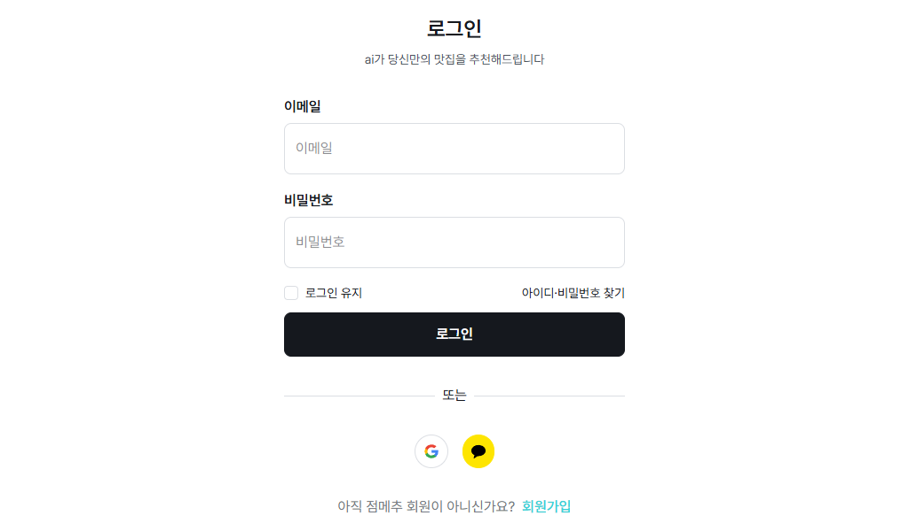
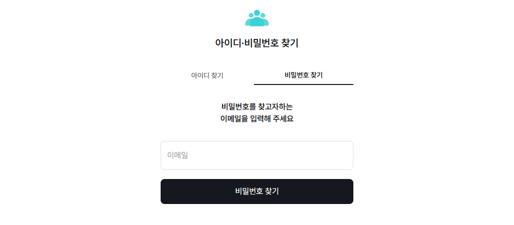

# 점메추(Jummechu) - 맛집 검색 및 사용자 맞춤 추천 사이트

## 링크모음
- **서비스 주소**: [https://jummechu-web.vercel.app](https://jummechu-web.vercel.app)
- **클라이언트 GitHub**: [https://github.com/hanul-project-team/jummechu-client](https://github.com/hanul-project-team/jummechu-client)
- **서버 GitHub**: [https://github.com/hanul-project-team/jummechu-server](https://github.com/hanul-project-team/jummechu-server)
<br><br>

## 기술스택
###  Frontend
- **React 19**: 최신 React 기반 SPA
- **React Router DOM**: 클라이언트 사이드 라우팅
- **Redux Toolkit**, **Zustand**: 전역 상태 관리
- **React Hook Form**, **Zod**: 폼 처리 및 유효성 검증
- **Tailwind CSS**, **Tailwind Gradients**, **Headless UI**: 스타일링 및 유틸리티 기반 UI 구성
- **Recharts**, **Swiper**, **React Rating**: 시각화 및 UI 구성 요소

###  API 통신
- **Axios**: 서버와의 HTTP 요청 처리

###  UX 향상
- **React Toastify**: 사용자 피드백 알림
- **React Markdown**, **React Transition Group**: 마크다운 렌더링 및 애니메이션

###  Dev Tools
- **Vite**: 빠른 번들러 및 개발 서버
- **ESLint**, **Prettier**: 코드 스타일 및 정적 분석
<br><br>

## 폴더구조
```bash
jummechu-client/
│
├── node_modules/
├── public/
├── src/
│   ├── app/              # 앱 진입점 설정, react-router 설정, 전역 상태 설정 파일 등       
│   ├── assets/           # 이미지, 스타일 등 정적 파일
│   ├── features/         # 기능 단위로 분류된 컴포넌트 
│   ├── layouts/          # header, footer 등 레이아웃 구성 요소를 담고 있는 폴더
│   ├── pages/            # 라우팅 되는 실제 페이지 컴포넌트
│   └── shared/           # 공통 컴포넌트, 유틸리티 함수 파일 등
├── .env                  # 공통 환경변수 설정 파일
├── .env.development      # 개발용 환경변수 설정 파일
├── .gitignore
├── .prettierrc
├── eslint.config.js
├── index.html
├── package.json
├── README.md
├── vercel.json
├── vite.config.js
└── yarn.lock
```
<br><br>

## 환경변수 설정
```bash
.env
VITE_GOOGLE_CLIENT_ID=your-google-client-id
VITE_KAKAO_API_KEY=your-kakao-API_key
VITE_KAKAO_KEY=your-kakao-key
VITE_KAKAO_REDIRECT_URI=http://localhost:5173/kakao_callback

.env.development
VITE_API_BASE_URL=http://localhost:3000
```
<br><br>

## 주요기능
- **회원 유형에 따른 차별화된 서비스 제공**
    - 비회원, 일반 회원, 사업자 회원, 관리자

- **회원 관리 기능** *(문승준)*
    - 로그인, 회원가입 (일반회원, 사업자회원)
    - 아이디/비밀번호 찾기 및 재설정
    - 소셜 간편가입 및 소셜 로그인 지원 
    - 계정 설정 및 개인정보 관리

- **맛집 검색 및 정보 열람** *(신디모데)*
    - 홈 화면에서 위치 및 키워드 기반으로 음식점 리스트를 보여줌 
    - 검색을 통해 음식점 정보 조회 가능
    - 상세정보 화면에서 음식점 정보, 리뷰, 평점 확인 및 리뷰 작성, 찜 목록 추가 가능 (비회원 일부 기능 제한)

- **일반 회원 기능** *(안세환)*
    - 최근에 본 음식점 리스트 확인
    - 사용자가 찜한 리스트 확인
    - 작성한 리뷰 확인 및 수정, 삭제 가능
    - 사용자 알고리즘 기반 음식점 추천

- **사업자 회원 기능** *(민인하)*
    - 누구나 가입 가능 (단, 음식점 관리 기능은 입점 승인 후 사용 가능)
    - 대시보드에서 사업자 정보 입력 후 입점 요청 가능
    - 입점 승인된 사업자는 음식점 소개글 작성, 리뷰 및 평점 관리 가능

- **관리자 기능** *(개발중)*
    - 전체 회원 목록 조회 및 회원 관리
    - 사용자 리뷰 모니터링 및 삭제 등 관리 기능
    - 사업자 회원의 입점 신청 승인 및 거절
    - 입점 승인된 음식점 목록 및 정보 관리
    - 전체 서비스 운영을 위한 전반적인 사이트 관리 기능 제공
<br><br>

## 서비스 화면 미리보기
### 홈 화면
사용자가 처음 접하게 되는 홈 화면. 검색 및 사용자 위치 기반 추천 리스트를 확인 가능


### 상세 페이지
리스트에서 항목을 클릭하면 상세 페이지로 이동하여 추가 정보를 확인할 수 있음


### 마이 페이지
사용자는 마이 페이지에서 개인 정보와 설정을 관리할 수 있습니다.


### 로그인 화면
로그인 페이지에서는 이메일/비밀번호로 로그인하거나 소셜 로그인 옵션을 선택 가능



###  아이디/비밀번호 찾기
아이디나 비밀번호를 잊어버렸을 때, 재설정을 할 수 있는 화면

 
 